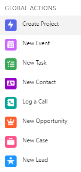
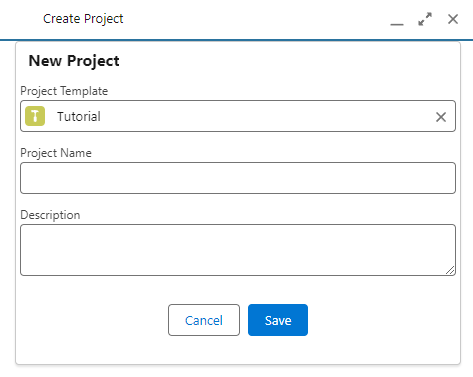

# Project Management System

Project Tracker Lightning Web Components (LWC)

## Table of Contents

- [Introduction](#introduction)
- [Features](#features)
- [Installation](#installation)
- [Usage](#usage)
- [Screenshots](#screenshots)
- [Technologies](#technologies)
- [Contributing](#contributing)
- [License](#license)

## Introduction

A Lightning Web Components (LWC) designed to allow the user to create a Project, a Milestone, and/or a To-Do Item efficiently, using templates and other automations, from anywhere in Salesforce. 

## Features

Call the component `Create Project` as a Global Action:

Component can be used as a corner modal, or as an expanded view:

# Technologies

The Lightning Web Component `projectFormCreate` is embedded within an Aura component to enable the Global Action behavior. It has also been enabled as a Screen Action, so it can be used for Flows, Processes, or as a component in Lightning Pages.

Each of Project, Milestone, and To-Do Item has a Template mirror object in order to prevent repetitive tasks. Templates must be active in order to be used. When a template is selected, mandatory fields such as Name, as well as optional fields such as Description, will be automatically filled if not provided by the user. 
